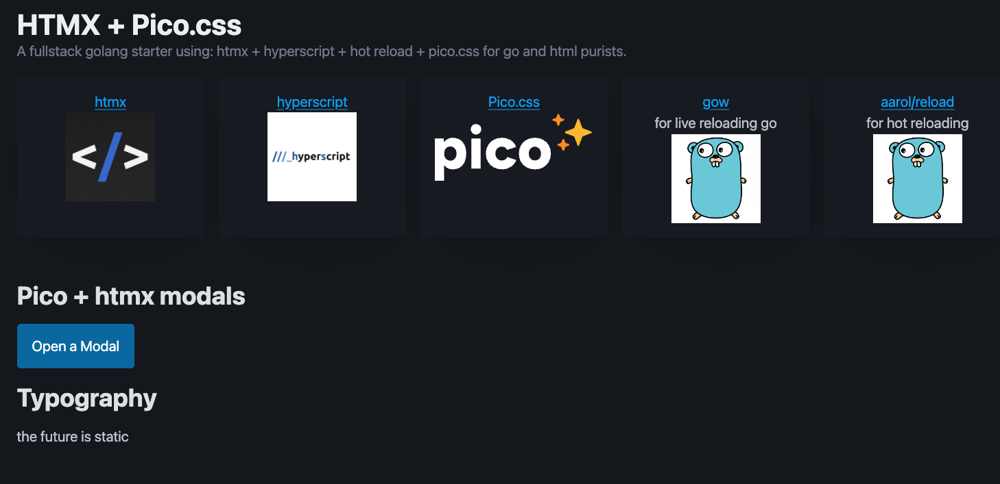

# htmx-hyperscript-starter
A full stack starter go project using [HTMX](https://htmx.org/reference/) + [Hyperscript](https://hyperscript.org/reference/) + [Pico.css](https://v2.picocss.com/docs/modal) with browser hot reloading and live reloading

## Quick Start
Assuming you have `go` and [gow](https://github.com/mitranim/gow) installed you can simply do the following: 
- Click 'Use this template' button above or [click here](https://github.com/new?template_name=htmx-hyperscript-starter&template_owner=zachatrocity)
- Clone your repo
- Run `./dev.sh`

## Preview

## Options
- `--port`: specficy the port to run on

## Motivation
There are quite a hodge podge of starter templates for the HTMX stack however most of them were very opinionated on frontend frameworks and many even leveraged the npm eco system which felt yucky to me.

## Dependencies
- Go
- Gow (for live reload of .go code, browser code will still hot reload without gow)
- [aarol/reload](https://github.com/aarol/reload) for hot reload of the web browser

## Optional Dependencies
- Pico.css - put whatever css framework you would like in the index.html `head`

## Roadmap
- ✅ Add api boilerplate for backend API
- ⬜ Add simple authentication flow

### Repo
Source of truth for myself is on my [sr.ht repo](https://git.sr.ht/~zachr/htmx-hyperscript-starter) but I keep this up to date for the templating in Github
